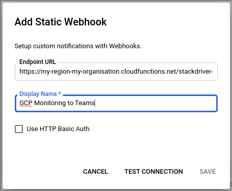

# gcp-monitoring-to-teams

⚙️ A simple Google Cloud Function in Go to transform / proxy [Google Cloud Platform (GCP) Monitoring](https://cloud.google.com/monitoring) static webhook notifications to [Microsoft Teams](https://teams.microsoft.com/).

_Forked from https://github.com/Courtsite/stackdriver-to-discord_

## Getting Started

### Prerequisites

- Ensure you have `gcloud` installed:
    - MacOS: `brew cask install google-cloud-sdk`
    - Others: https://cloud.google.com/sdk/gcloud
- Ensure you have authenticated with Google Cloud: `gcloud init`
- (Optional) Set your current working project: `gcloud config set project <project>`

### Deployment

1. Clone / download a copy of this repository
2. Copy `.env.sample.yaml` to `.env.yaml`, and modify the environment variables declared in the file
3. Run `./deploy.sh`
4. Configure GCP Monitoring static webhook notification channel in https://console.cloud.google.com/monitoring/alerting/notifications

_Be sure to append `?auth_token=<AUTH_TOKEN>` to the end of the URL under `httpsTrigger` (returned in the output from (3)). e.g. https://my-region-my-organisation.cloudfunctions.net/gcp-monitoring-to-teams?auth_token=123456._

